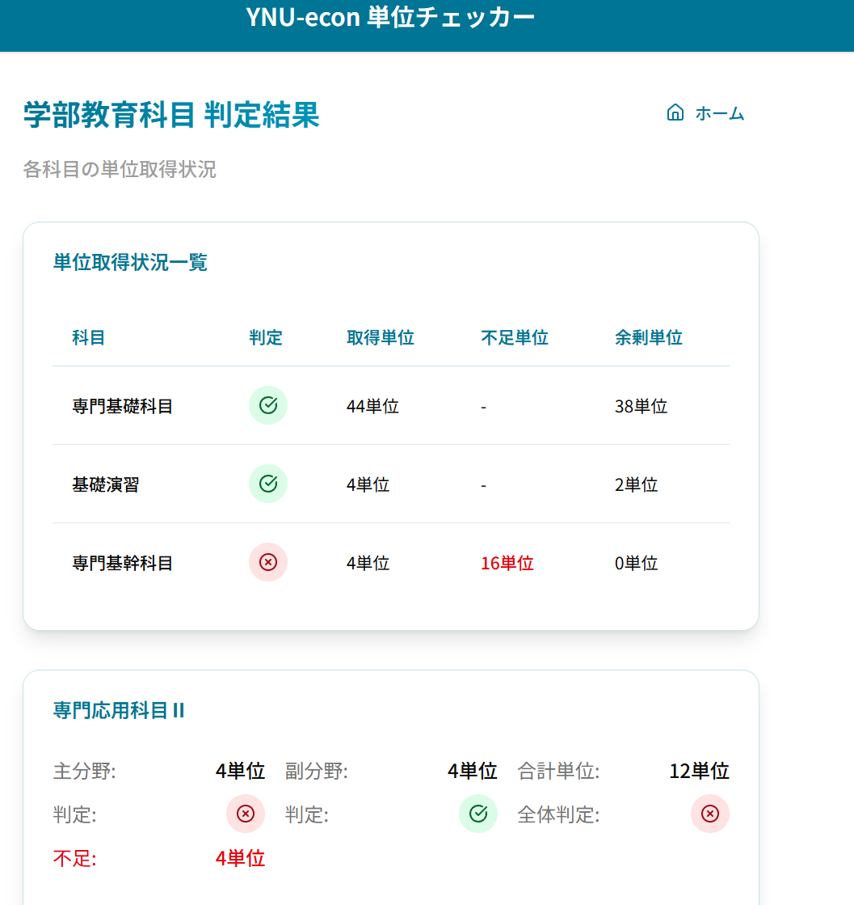

# YNU ECON Credit Checker（横浜国立大学経済学部 単位チェッカー）




## 概要

横浜国立大学経済学部の学生が卒業要件を満たすために必要な単位を簡単に確認できるWebアプリケーションです。全学教育科目と学部教育科目の取得状況を入力すると、各カテゴリーごとの充足状況や不足単位数を自動計算し、視覚的に表示します。

**デモサイト**: -https://ynu-econ-credit-checker.vercel.app/
**制作期間**: -2週間

## 主な機能

- 全学教育科目（34単位）の単位充足判定機能
- 学部教育科目（90単位）の単位充足判定機能
- カテゴリー別の取得単位・不足単位・余剰単位の自動計算
- 余剰単位の自動振替機能（全学教育その他カテゴリー）
- レスポンシブデザイン（デスクトップ・モバイル対応）

## 使用技術

### フロントエンド
- **Next.js 15** (App Router) - React フレームワーク
- **React 19** - UI ライブラリ
- **TypeScript** - 型安全な開発
- **Tailwind CSS 4** - スタイリング
- **Zod** - スキーマバリデーション
- **Conform** - フォーム管理とバリデーション
- **Lucide React** - アイコン

### 開発・品質管理
- **Vitest** - テスティングフレームワーク
- **React Testing Library** - コンポーネントテスト
- **Storybook** - コンポーネント開発環境
- **Biome** - リンター・フォーマッター
- **Lefthook** - Git フック管理
- **Bun** - パッケージマネージャー・ランタイム


## セットアップ方法

### Requirements

- Bun
- Node.js

```shell
mise install
```

### Run locally

```shell
cd frontend
bun install   # 初回のみ
bun run dev
```


アプリケーションは http://localhost:3000 で起動します。


